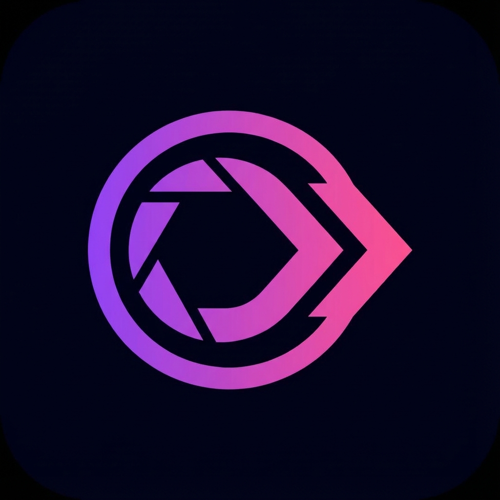

# VibeSelect

<div align="center">
  
  
  **A Tinder-style photo selection app for photographers and clients.**
  
  [](https://nextjs.org)
  [](https://supabase.com)
  [](https://tailwindcss.com)
</div>

---

## ✨ Features

- **Swipe to Select** — Tinder-style card swiping for intuitive photo selection
- **Grid View** — See all photos at once with filter tabs (Selected, Maybe, Rejected)
- **Google Drive Sync** — Link a public folder and import photos instantly
- **WhatsApp Integration** — Send final selections directly via WhatsApp
- **Photographer Dashboard** — Manage events, branding, and client links
- **Portfolio Website** — Create a stunning personal landing page with gallery, pricing, and contact info
- **Dark Mode** — Full dark theme support

## 🛠 Tech Stack

| Layer | Technology |
|-------|------------|
| Framework | Next.js 15 (App Router) |
| Database | Supabase (PostgreSQL) |
| Auth | Supabase Auth |
| Storage | Google Drive API |
| Styling | Tailwind CSS |
| Animation | Framer Motion |
| Icons | Lucide React |

## 🚀 Getting Started

### Prerequisites

- Node.js 18+
- Supabase account
- Google Cloud API Key (for Drive API)

### Installation

```bash
# Clone the repository
git clone https://github.com/YOUR_USERNAME/vibeselect.git
cd vibeselect

# Install dependencies
npm install

# Copy environment variables
cp .env.example .env.local
```

### Environment Variables

Create `.env.local` with:

```env
NEXT_PUBLIC_SUPABASE_URL=https://your-project.supabase.co
NEXT_PUBLIC_SUPABASE_ANON_KEY=your-anon-key
GOOGLE_API_KEY=your-google-api-key
```

### Database Setup

Run the SQL schema in your Supabase SQL Editor:

```sql
-- See supabase_setup.sql for full schema
```

### Development

```bash
npm run dev
```

Open [http://localhost:3000](http://localhost:3000)

## 📱 Screenshots

| Swipe View | Grid View | Dashboard |
|------------|-----------|-----------|
|  |  |  |

## 🌐 Deployment

### Vercel

1. Push to GitHub
2. Import project in [Vercel](https://vercel.com)
3. Add environment variables
4. Deploy!

### Supabase Production

1. Add your Vercel domain to **Authentication → URL Configuration**
2. Ensure RLS policies are enabled on all tables

## 📄 License

MIT © 2024

---

<div align="center">
  Made with ❤️ for photographers
</div>
